# Database Design

PostgreSQL is the source of truth for identity-linked product data, access decisions, and audit history. The executable schema is in `backend/migrations/`; this document describes its boundaries and the ER model. The migrations target Supabase PostgreSQL and use `auth.users` as the authentication identity provider.

## Core Decisions

- Every table uses a UUID primary key. Product-owned UUIDs default to `gen_random_uuid()`; `users.id` is the matching `auth.users.id`.
- Every table has `created_at` and `updated_at`. A shared trigger maintains `updated_at` on updates. Audit history is append-only by policy and should not be updated through application paths.
- User rows are shared identity records. Mentor and mentee details live in separate one-to-one profile tables. A user can only be active in the role(s) represented by their profiles; profile creation and role changes must be performed by trusted backend code.
- FMGE, NEET PG, and INICET are catalog rows, not separate schema branches. Subjects/topics, tests/questions, plans, and access grants are associated with exam IDs. Composite foreign keys prevent cross-exam test/question and subject/topic mismatches.
- A mentor-mentee relationship is a pair of participants, not a global singleton. Multiple mentors can serve many mentees, and one mentee can have multiple mentor relationships. The `is_master_mentor` flag identifies an initial master mentor; a partial unique index permits at most one non-deleted master without limiting ordinary mentors.
- A mentee may have at most one pending, trialing, active, or past-due subscription per exam. Different exams can be subscribed to independently. Cancelled, expired, and soft-deleted subscription rows remain historical. If product rules later require one subscription total across all exams, change the partial unique index in a reviewed migration.
- A subscription references an exam-specific plan. `plan_entitlements` describes what the plan offers; an insert trigger snapshots those grants into `subscription_entitlements`. Access checks use entitlement codes, time bounds, revocation, exam, and subscription status, rather than hardcoded plan IDs. Entitlement changes do not silently rewrite existing subscription snapshots.
- `content_access` captures explicit user/content grants and their source. Content can also carry `required_entitlement_code`; published content with no required code is available to authenticated users, while restricted content requires that entitlement or an explicit grant.
- Money is stored as integer minor units with an ISO-style three-character currency code. Provider IDs and idempotency keys are unique where supplied. Provider secrets and card data do not belong in these tables.

## Entity Relationship Diagram

```mermaid
erDiagram
    users ||--o| mentor_profiles : profile
    users ||--o| mentee_profiles : profile
    exams ||--o{ subjects : contains
    subjects ||--o{ topics : contains
    mentee_profiles ||--o{ mentee_exam_enrollments : enrolls
    exams ||--o{ mentee_exam_enrollments : targets
    exams ||--o{ subscription_plans : offers
    subscription_plans ||--o{ plan_entitlements : grants
    mentee_profiles ||--o{ subscriptions : owns
    exams ||--o{ subscriptions : targets
    subscription_plans ||--o{ subscriptions : prices
    subscriptions ||--o{ subscription_entitlements : grants
    subscriptions ||--o{ payments : billed_by
    mentor_profiles ||--o{ mentor_mentee_relationships : mentors
    mentee_profiles ||--o{ mentor_mentee_relationships : receives
    exams ||--o{ content : scopes
    subjects o|--o{ content : classifies
    topics o|--o{ content : classifies
    mentor_profiles o|--o{ content : authors
    content ||--o{ content_access : grants
    users ||--o{ content_access : receives
    subscriptions o|--o{ content_access : source
    mentee_profiles ||--o{ study_plans : owns
    mentor_profiles o|--o{ study_plans : creates
    exams ||--o{ study_plans : targets
    study_plans ||--o{ study_plan_tasks : contains
    topics o|--o{ study_plan_tasks : references
    study_plan_tasks ||--o{ task_completions : completed_as
    mentee_profiles ||--o{ task_completions : completes
    exams ||--o{ tests : scopes
    mentor_profiles o|--o{ tests : authors
    exams ||--o{ questions : scopes
    subjects ||--o{ questions : classifies
    topics o|--o{ questions : classifies
    mentor_profiles o|--o{ questions : authors
    questions ||--o{ question_options : offers
    tests ||--o{ test_questions : contains
    questions ||--o{ test_questions : selected_as
    tests ||--o{ test_attempts : attempted
    mentee_profiles ||--o{ test_attempts : takes
    test_attempts ||--o{ test_answers : records
    test_questions ||--o{ test_answers : answered
    test_answers ||--o{ test_answer_options : selects
    question_options ||--o{ test_answer_options : selected
    users o|--o{ conversations : creates
    mentor_mentee_relationships o|--o{ conversations : context
    conversations ||--o{ conversation_members : includes
    users ||--o{ conversation_members : joins
    conversation_members ||--o{ messages : sends
    messages ||--o{ message_attachments : attaches
    users ||--o{ notifications : receives
    users ||--o| notification_preferences : configures
    users o|--o{ announcements : authors
    exams o|--o{ announcements : scopes
    users o|--o{ audit_logs : acts
    mentee_profiles ||--o{ analytics_events : scopes
    users o|--o{ analytics_events : acts

    users {
        uuid id PK
        text role
    }
    mentor_profiles {
        uuid id PK
        uuid user_id FK
    }
    mentee_profiles {
        uuid id PK
        uuid user_id FK
    }
    exams {
        uuid id PK
        text code UK
    }
    subjects {
        uuid id PK
        uuid exam_id FK
        text code
    }
    topics {
        uuid id PK
        uuid subject_id FK
        text code
    }
    mentee_exam_enrollments {
        uuid id PK
        uuid mentee_user_id FK
        uuid exam_id FK
    }
    subscription_plans {
        uuid id PK
        uuid exam_id FK
        text code
    }
    plan_entitlements {
        uuid id PK
        uuid plan_id FK
        text entitlement_code
    }
    subscriptions {
        uuid id PK
        uuid mentee_user_id FK
        uuid exam_id FK
        uuid plan_id FK
    }
    subscription_entitlements {
        uuid id PK
        uuid subscription_id FK
        text entitlement_code
    }
    payments {
        uuid id PK
        uuid subscription_id FK
        text provider
    }
    mentor_mentee_relationships {
        uuid id PK
        uuid mentor_user_id FK
        uuid mentee_user_id FK
    }
    content {
        uuid id PK
        uuid exam_id FK
        text required_entitlement_code
    }
    content_access {
        uuid id PK
        uuid content_id FK
        uuid user_id FK
    }
    study_plans {
        uuid id PK
        uuid mentee_user_id FK
        uuid exam_id FK
        uuid created_by_mentor_user_id FK
    }
    study_plan_tasks {
        uuid id PK
        uuid study_plan_id FK
        uuid topic_id FK
    }
    task_completions {
        uuid id PK
        uuid task_id FK
        uuid mentee_user_id FK
    }
    tests {
        uuid id PK
        uuid exam_id FK
    }
    questions {
        uuid id PK
        uuid exam_id FK
        uuid subject_id FK
    }
    question_options {
        uuid id PK
        uuid question_id FK
    }
    test_questions {
        uuid id PK
        uuid test_id FK
        uuid question_id FK
        uuid exam_id FK
    }
    test_attempts {
        uuid id PK
        uuid test_id FK
        uuid mentee_user_id FK
    }
    test_answers {
        uuid id PK
        uuid attempt_id FK
        uuid question_id FK
    }
    test_answer_options {
        uuid id PK
        uuid test_answer_id FK
        uuid option_id FK
    }
    conversations {
        uuid id PK
        uuid relationship_id FK
    }
    conversation_members {
        uuid id PK
        uuid conversation_id FK
        uuid user_id FK
    }
    messages {
        uuid id PK
        uuid conversation_id FK
        uuid sender_user_id FK
    }
    message_attachments {
        uuid id PK
        uuid message_id FK
        text storage_path UK
    }
    notifications {
        uuid id PK
        uuid user_id FK
    }
    notification_preferences {
        uuid id PK
        uuid user_id FK
    }
    announcements {
        uuid id PK
        uuid author_user_id FK
        uuid exam_id FK
    }
    audit_logs {
        uuid id PK
        uuid actor_user_id FK
        text entity_table
    }
    analytics_events {
        uuid id PK
        uuid mentee_user_id FK
        uuid actor_user_id FK
        uuid exam_id FK
    }
```

## Tables and Integrity

| Table | Foreign keys and notable integrity rules | Lifecycle |
| --- | --- | --- |
| `users` | `id` references Supabase `auth.users`; role and account status checks; case-insensitive unique live email | `deleted_at`; close/suspend through status first |
| `mentor_profiles` | unique `user_id`; at most one live master mentor; profile status check | `deleted_at` |
| `mentee_profiles` | unique `user_id`; valid graduation year; profile status check | `deleted_at` |
| `exams` | unique code restricted to FMGE, NEET_PG, INICET | `archived_at` |
| `subjects` | exam FK; unique exam/code and `(id, exam_id)` for composite references; nonnegative order | `archived_at` |
| `topics` | subject FK; unique subject/code and `(id, subject_id)`; nonnegative order | `archived_at` |
| `mentee_exam_enrollments` | unique mentee/exam pair | `deleted_at` |
| `subscription_plans` | exam FK; unique exam/code and `(id, exam_id)`; nonnegative price; interval/currency checks | `archived_at` |
| `plan_entitlements` | plan FK; unique plan/code; lowercase code and object JSON config | Retained as plan history |
| `subscriptions` | mentee, exam, and composite plan/exam FKs; one pending/current subscription per mentee/exam; valid date range; unique provider subscription ID | Status plus `deleted_at` |
| `subscription_entitlements` | subscription FK; unique subscription/code; valid date range; lowercase code | Revoke using `revoked_at` |
| `payments` | subscription FK; nonnegative amount; unique provider/idempotency key and provider payment ID | Retain financial history; status records outcome |
| `mentor_mentee_relationships` | mentor and mentee profile FKs; self-link rejected; one pending/current pair | Status plus `deleted_at` |
| `content` | optional exam/subject/topic and author FKs; composite FKs prevent mismatched subject/topic; requires a storage path or URL | `archived_at` |
| `content_access` | content/user/subscription FKs; source-specific checks; unique effective grant; date range | Revoke using `revoked_at` |
| `study_plans` | mentee and exam FKs; optional mentor creator FK; valid date range | `archived_at` |
| `study_plan_tasks` | plan and optional topic FKs; nonnegative order; status check | `deleted_at` |
| `task_completions` | task and mentee FKs; unique task/mentee completion | Retain completion record |
| `tests` | exam and optional author FKs; valid duration and publication status | `archived_at` |
| `questions` | exam, subject, optional topic, and author FKs; composite exam/subject/topic consistency | `archived_at` |
| `question_options` | question FK; unique question/order and question/option pair | Cascade with question |
| `test_questions` | test and question FKs scoped to the same exam; unique question and position per test; nonnegative marks | Cascade with test |
| `test_attempts` | test and mentee FKs; status and chronological checks | Retain attempt; void instead of deleting |
| `test_answers` | composite attempt/test and test/question FKs; one answer per attempt/question; nonnegative score | Cascade with attempt |
| `test_answer_options` | composite answer/question and question/option FKs; unique selected option per answer | Cascade with answer |
| `conversations` | optional creator and relationship FKs; conversation/status checks | `archived_at` |
| `conversation_members` | unique conversation/user; membership dates; composite key supports message sender integrity | Retain; set `left_at` |
| `messages` | sender must be a member of that conversation; nonempty body unless attachment message | `deleted_at` |
| `message_attachments` | message FK; unique storage path; nonnegative byte count | `deleted_at`; delete backing object per retention policy |
| `notifications` | user FK; unique optional per-user deduplication key | `deleted_at`; delivery/read timestamps |
| `notification_preferences` | unique user; quiet-hours endpoints supplied together | Updated in place |
| `announcements` | optional author/exam FKs; audience and expiry checks | `archived_at` |
| `audit_logs` | optional actor FK set null on user deletion; JSON object checks | Append-only; retain per compliance policy |
| `analytics_events` | required mentee FK; optional actor and exam FKs; object JSON payload | Server-written; retained per analytics policy |

Indexes cover FK lookups and principal browse paths: active catalog/content, exam and status, user-owned records, due study tasks, chronological messages/payments/attempts, active grants, and audit lookup by actor/entity/request. Partial unique indexes encode live-only uniqueness, so archived/deleted history does not prevent replacement records.

## Access and Security

All application tables have row-level security enabled. Policies expose a user's own identity/profile, subscriptions, payments, notifications, preferences, and study progress; public catalog rows and published free content are readable to authenticated users; messages require active conversation membership. Billing, profile creation, content grants, assessments, announcements, and audit writes intentionally have no client write policy and belong behind trusted server code. The Supabase service role bypasses RLS and must never be shipped to an app.

`has_active_entitlement(code, exam_id)` is the shared entitlement predicate. `can_access_content(content_id)` evaluates explicit grants. These functions run as security definers with a fixed search path; changes to them or their grants require security review. The entitlement snapshot trigger copies the selected plan's grant set when a subscription row is created. The payment integration must update subscription state only after verified provider events and should make those transitions idempotent.

## Deletion, Privacy, and Operations

User-owned operational records are generally soft-deleted or status-transitioned. Catalog, plan, content, test, question, study-plan, conversation, and announcement records are archived. Financial events and test attempts are retained; content grants are revoked; conversations retain membership/message history. FK cascades are reserved for dependent components such as options, answer selections, attachments, or identity-owned profile rows. Hard deletion of a Supabase Auth identity cascades to `users` and dependent user-owned rows; use a reviewed privacy-erasure workflow rather than deleting Auth identities casually.

The development seed contains only synthetic catalog and zero-cost development plans. It does not create authentication users or credentials. Create local identities through Supabase Auth, then create corresponding `users` and profile rows through trusted backend code. Never run the development seed against staging or production.
